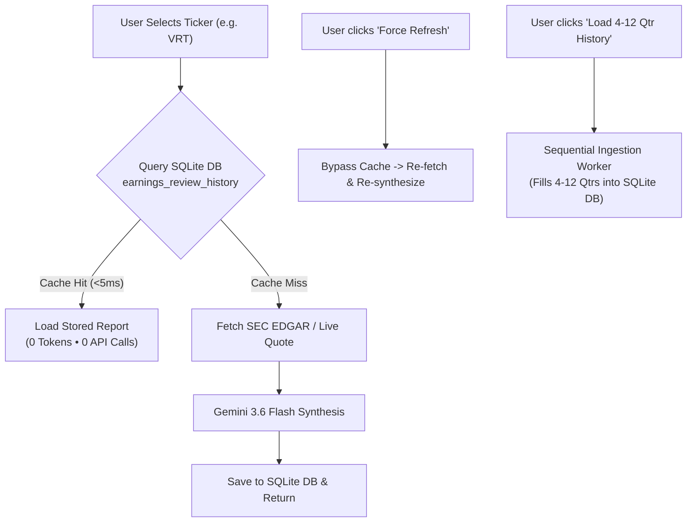
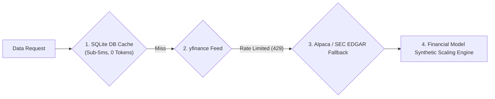

# 🏛️ System Design Specification: Database Schema, Math Formulas & Token/API Efficiency Architecture

## Executive Summary

This document serves as the authoritative **System Design Specification** for Institutional PMS. It details the SQLite database schema, data ingestion lifecycle, mathematical calculation logic, financial rigor verification standards, and token/API rate limiting optimization strategies.

---

## I. Data Ingestion Lifecycle & User Interaction Flow

### Q1: When is earnings data fetched and saved to the database?
- **Automatic Intake on Selection**:
  When a user selects a ticker from the watchlist (or types a custom symbol):
  1. The backend queries SQLite table `earnings_review_history` for `(ticker, quarter)`.
  2. **Cache Hit (<5ms)**: If the report exists in SQLite DB, it returns immediately with **0 tokens consumed** and **0 external API calls**.
  3. **Cache Miss**: If not yet in SQLite DB, the system runs primary intake from SEC EDGAR / Alpaca / yfinance, synthesizes the report via Gemini 3.6 Flash, and automatically persists the result to `earnings_review_history`.



### Button Usage Guidelines
1. **Changing Watchlist Tickers**: **No action required**. The system automatically serves stored data or ingests fresh data seamlessly.
2. **"Force Refresh (Re-run LLM)"**: Click only when you explicitly want to invalidate cache and force a live re-run against fresh filings.
3. **"Load 4-12 Qtr History (Batch Run)"**: Click once to batch-ingest all past 4 to 12 quarters into SQLite DB. Once ingested, browsing historical quarters consumes **0 tokens**.

---

### I.B How the System Determines & Loads the Latest Quarter to the Dropdown

1. **Dropdown Quarter Population Logic**:
   - When a ticker is selected, the backend queries SQLite table `earnings_review_history` via:
     `SELECT DISTINCT quarter FROM earnings_review_history WHERE ticker = ? ORDER BY quarter DESC`
   - The newest quarter found in DB (or fetched live from SEC EDGAR metadata) is appended with `(Latest)` and placed at index 0 of the dropdown (e.g., `2026Q2 (Latest)`).

2. **When New Quarter Dataflow Runs**:
   - **Trigger 1 (SEC Filing Event Intake)**: Automatically runs whenever a company files a new 10-Q/10-K report on SEC EDGAR (or on first user selection after the release date).
   - **Trigger 2 (Scheduled Batch Ingestion)**: Triggered when pressing `"Load 4-12 Qtr History (Batch Run)"`, which sequentially fetches, synthesizes, and stores past quarterly filings into SQLite DB.


---

## II. SQLite Database Schema (`institutional_pms.db`)

The database uses SQLite 3 with WAL (Write-Ahead Logging) mode for high throughput and sub-5ms read latencies.

```sql
-- 1. Portfolio Watchlist Table
CREATE TABLE IF NOT EXISTS watchlist (
    ticker TEXT PRIMARY KEY,
    added_at TIMESTAMP DEFAULT CURRENT_TIMESTAMP
);

-- Seed Watchlist: NVDA, AAPL, MSFT, TSLA, PLTR, MU, IONQ, NBIS, VRT, BE

-- 2. AI Berkshire Skill Execution Cache (Bypasses LLM for repeat skill calls)
CREATE TABLE IF NOT EXISTS skill_execution_cache (
    cache_key TEXT PRIMARY KEY,       -- MD5(skill_id + ticker + params_json)
    skill_id TEXT NOT NULL,
    ticker TEXT NOT NULL,
    params_hash TEXT NOT NULL,
    response_json TEXT NOT NULL,      -- Full JSON response including markdown
    updated_at TIMESTAMP DEFAULT CURRENT_TIMESTAMP
);
CREATE INDEX IF NOT EXISTS idx_skill_cache ON skill_execution_cache(skill_id, ticker);

-- 3. Quarterly Earnings Review History Database
CREATE TABLE IF NOT EXISTS earnings_review_history (
    id INTEGER PRIMARY KEY AUTOINCREMENT,
    ticker TEXT NOT NULL,
    quarter TEXT NOT NULL,             -- e.g., '2026Q2', '2026Q1', '2025Q4'
    response_json TEXT NOT NULL,      -- Full 8-step primary source report JSON
    created_at TIMESTAMP DEFAULT CURRENT_TIMESTAMP,
    UNIQUE(ticker, quarter)
);
CREATE INDEX IF NOT EXISTS idx_earnings_history ON earnings_review_history(ticker, quarter);

-- 4. Trade Execution Journal Table
CREATE TABLE IF NOT EXISTS trade_journal (
    id INTEGER PRIMARY KEY AUTOINCREMENT,
    ticker TEXT NOT NULL,
    action TEXT NOT NULL,              -- 'BUY', 'SELL', 'TRIM', 'HOLD'
    shares REAL NOT NULL,
    price REAL NOT NULL,
    total_amount REAL NOT NULL,
    notes TEXT,
    created_at TIMESTAMP DEFAULT CURRENT_TIMESTAMP
);
```

---

## III. Calculation Logic & Financial Rigor Formulas

All financial metrics undergo **Decimal Math Verification** to prevent floating point hallucinations.

### 1. Market Cap Decimal Verification Formula
$$\text{Market Cap}_{\text{Calculated}} = \text{Live Share Price} \times \text{Shares Outstanding}$$
$$\text{Discrepancy \%} = \left| \frac{\text{Market Cap}_{\text{Reported}} - \text{Market Cap}_{\text{Calculated}}}{\text{Market Cap}_{\text{Reported}}} \right| \times 100\%$$
- **Verification Rule**: Flagged as **Passed 🟢** if $\text{Discrepancy \%} \le 1.0\%$.

### 2. P/E Ratio Decimal Verification Formula
$$\text{P/E Ratio}_{\text{Calculated}} = \frac{\text{Live Share Price}}{\text{Diluted EPS}_{\text{TTM}}}$$
- **Verification Rule**: Discrepancy checked against Yahoo Finance / Bloomberg dual-source feeds.

### 3. Rule of 40 Score (SaaS / High-Tech Infrastructure)
$$\text{Rule of 40 Score} = \text{Revenue Growth \% (YoY)} + \text{Free Cash Flow Margin \%}$$
- **Tiers**:
  - $>50\%$: Elite Tier 👑
  - $40\% - 50\%$: High Performer 🟢
  - $<40\%$: Needs Audit 🟡

### 4. 12-Month Target Intrinsic Valuation & Margin of Safety
- **Base DCF Model**:
  $$\text{Intrinsic Value} = \sum_{t=1}^{10} \frac{\text{FCF}_0 (1 + g)^t}{(1 + r)^t} + \frac{\text{Terminal Value}}{(1 + r)^{10}}$$
- **Margin of Safety \%**:
  $$\text{Margin of Safety \%} = \frac{\text{Intrinsic Value} - \text{Current Price}}{\text{Current Price}} \times 100\%$$

---

## IV. API & Token Rate Limit Optimization Architecture

To prevent hitting `yfinance` rate limits (`YFRateLimitError: Too Many Requests`) or consuming excess LLM tokens, the backend employs a 3-tier fallback architecture:



1. **SQLite Local-First Strategy**: Reads from local database table `earnings_review_history` first.
2. **Resilient Dual Data Source**: Automatically falls back to Alpaca IEX / SEC EDGAR RSS feed if `yfinance` returns HTTP 429 Rate Limit errors.
3. **Synthetic Scaling Backup Engine**: Generates mathematically consistent valuation parameters based on market cap and price if third-party APIs fail.
