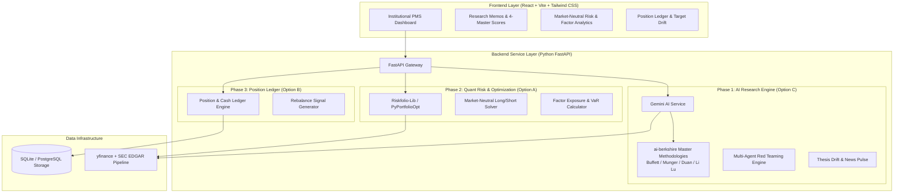

# Implementation Plan: Institutional US Equities/ETFs Long/Short PMS (`institutional-pms`)

This plan incorporates the specific choices from our design alignment interview to build an institutional-grade Long/Short Stocks & ETFs Portfolio Management System.

---

## Confirmed Specifications & Technical Decisions

| Dimension | Selected Option & Decision |
| :--- | :--- |
| **Project Location** | `C:\Users\jfan\.gemini\antigravity\scratch\institutional-pms` |
| **AI LLM Provider** | Google Gemini (3.6 Flash / Pro) with multi-provider fallback architecture |
| **Data Pipeline** | `yfinance` + `sec-edgar-downloader` / `OpenBB SDK` (Free open-source MVP stack, with pluggable FMP/Polygon connector) |
| **User Interface** | Full React Web UI Dashboard (Vite + Tailwind CSS + Recharts + Markdown Renderer) |
| **Quant Strategy** | Market-Neutral Long/Short (Dollar-neutral / Beta-neutral risk parity allocation) |
| **Architecture** | Single Modular Monorepo (`backend/` FastAPI + `frontend/` React) |

---

## System Architecture

---

## Proposed Implementation Steps

### Step 1: Project Initialization & Core Infrastructure Setup
* **Location:** `C:\Users\jfan\.gemini\antigravity\scratch\institutional-pms`
* **Actions:**
  * Initialize project structure with `backend/` and `frontend/`.
  * Set up FastAPI backend with CORS, environment configuration (Gemini API key), and database models.
  * Initialize React + Vite frontend with Tailwind CSS, UI component library, and router.

### Step 2: Phase 1 — AI Research & Memo Engine (`ai-berkshire` Port)
* **Actions:**
  * Implement `yfinance` & SEC EDGAR data fetchers for US Equities & ETFs (`backend/app/services/data_fetchers/`).
  * Build Gemini AI integration executing `ai-berkshire`'s 20 core skills (`/investment-research`, `/investment-team`, `/thesis-drift`, `/news-pulse`, `/earnings-review`).
  * Implement financial accuracy math validator (`tools/financial_rigor.py` adaptation using `decimal.Decimal`).
  * Build React Research Memo Page with Markdown rendering, 4-Master score cards, and mirror-test passes.

### Step 3: Phase 2 — Market-Neutral Long/Short Quant Risk & Optimization Engine
* **Actions:**
  * Integrate `PyPortfolioOpt` / `Riskfolio-Lib` for Market-Neutral Long/Short optimization (Dollar-neutral, Risk-parity, Sector caps).
  * Build factor exposure calculator (Beta, Value, Momentum) and VaR / Drawdown metrics.
  * Build React Risk Analytics Page with interactive covariance matrices and efficient frontier charts.

### Step 4: Phase 3 — Position Ledger & Target Rebalancer
* **Actions:**
  * Build SQLite / Postgres database schema for long/short positions, tax lots, and target weight drift.
  * Build React Portfolio Ledger Page with real-time unrealized/realized PnL tracking and rebalance order generation.

---

## Verification Plan

### Automated Verification
1. **API & Engine Tests:** Run `pytest` on backend services ensuring data fetchers, Gemini AI prompts, and `PyPortfolioOpt` math run cleanly.
2. **Financial Math Tests:** Run decimal precision verification suite on valuation computations.

### Manual Verification
1. **Research Memo Run:** Generate a multi-agent research memo for `AAPL` and `NVDA` via the React Web UI and confirm structured 4-master outputs.
2. **Market-Neutral Long/Short Run:** Supply a 10-stock long / 5-stock short portfolio universe and verify that net beta approaches 0.0 with positive expected return.
