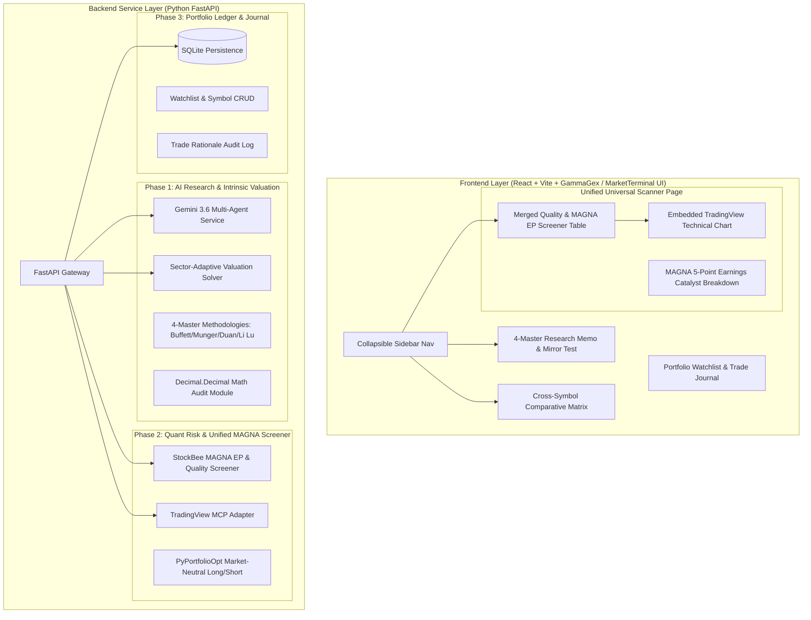

# Implementation Plan: Institutional US Equities/ETFs Long/Short PMS (`institutional-pms`)

This document details the architecture for `institutional-pms`, integrating qualitative AI fundamental research, sector-adaptive intrinsic valuation, StockBee MAGNA Episodic Pivot (EP) catalyst screening, embedded TradingView technical charting, and market-neutral quantitative risk optimization.

---

## 1. Architectural Enhancements & Key Decisions

| Dimension | Technical Specification |
| :--- | :--- |
| **Location** | `c:\Users\jfan\Documents\institutional-pms` |
| **UI Design System** | Premium Quantitative Styling inspired by `@MarketTerminal` & `@GammaGexTrading` (Deep navy `#070913`, glassmorphism `rgba(15, 18, 36, 0.75)`, fonts `'Outfit'` + `'Plus Jakarta Sans'`, neon glow accents, collapsible sidebar navigation, status pulse indicators) |
| **Unified Scanner** | **Merged Quality & Technical EP Scanner**: Single unified menu combining fundamental quality criteria (ROIC $\ge 15\%$, Debt/Equity $\le 1.0$, Moat Score $\ge 4.0$) with StockBee MAGNA EP triggers. |
| **Embedded TradingView Chart** | **In-Page Embedded Technical Chart**: TradingView interactive chart embedded directly inside the Universal Scanner page, dynamically switching symbols upon row selection. |
| **MAGNA Earnings Play Integration** | **StockBee MAGNA Criteria** integrated into `/earnings-review` & `/earnings-team` skills: **M**omentum ($\ge 8\%$ gap), **A**cceleration ($\ge 3.0\times$ RVOL), **G**ap Clearance, **N**ews/Earnings surprise ($\ge 15\%$), **A**ccumulation (HOD close ratio $\ge 85\%$). |
| **Intrinsic Valuation Engine** | **Sector-Adaptive Framework**: Automatically routes tickers to GICS sector models (Growth/SaaS $\rightarrow$ Rule of 40 & SBC-Adjusted FCF; Value/Financials $\rightarrow$ DDM & ROE-Ke; Tech/Hardware $\rightarrow$ DCF & EV/EBITDA). |
| **Portfolio Management** | Symbol Add/Remove CRUD, Watchlist state management, Cross-Symbol Side-by-Side Matrix. |

---

## 2. System Architecture

---

## 3. StockBee MAGNA Criteria & Earnings Play Integration

The **MAGNA** framework evaluates post-earnings Episodic Pivots across 5 quantitative and qualitative dimensions:

$$\text{MAGNA Composite Score} = w_M M + w_A A + w_G G + w_N N + w_{Acc} A_{cc}$$

1. **M — Momentum / Movement**: Opening price gap $\ge 8.0\%$ clearing multi-week resistance.
2. **A — Acceleration / Volume**: Relative Volume ($\text{RVOL} \ge 3.0\times$ 50-day SMA volume).
3. **G — Gap & Base Clearance**: Clean breakout above prior consolidation range with zero immediate overhead supply.
4. **N — News & Earnings Surprise**: Earnings Surprise $\ge +15.0\%$, YoY Revenue Acceleration $\ge +25\%$, and Gross Margin Expansion.
5. **A — Accumulation & Order Flow**: High-of-Day Close Ratio ($\frac{\text{Close} - \text{Low}}{\text{High} - \text{Low}} \ge 0.85$), proving institutional buy-and-hold order flow.

---

## 4. Proposed Implementation Phases

### Phase 1: AI Research, Sector Valuation & MAGNA Earnings Engine
* Implement `backend/app/services/sector_valuation.py` supporting GICS-specific intrinsic valuation.
* Implement StockBee MAGNA evaluation inside `/earnings-review` and `/earnings-team` skills.
* Port `financial_rigor.py` decimal verification.

### Phase 2: Unified Universal Scanner & Embedded TradingView Chart
* Implement `backend/app/services/unified_screener.py` combining fundamental quality metrics with MAGNA EP criteria.
* Integrate `tradingview-mcp` service for embedded technical charts inside the Scanner view.
* Build Market-Neutral Long/Short portfolio optimizer (`PyPortfolioOpt`).

### Phase 3: Portfolio Ledger, Symbol Comparison & UI Polish
* Implement SQLite database models for watchlists and trade journals (`实盘记录`).
* Apply `@MarketTerminal` / `@GammaGexTrading` design system across all React components.
* Build Cross-Symbol Comparison Matrix and Symbol CRUD modals.

---

## 5. Verification & Test Plan

### Automated Verification
1. **PyTest Suite**: Verify sector-adaptive valuation formulas, decimal rigor audits, and MAGNA EP screener calculations.
2. **API Endpoint Verification**: Test `/api/v1/research/analyze`, `/api/v1/screener/universal`, `/api/v1/comparison`, and `/api/v1/watchlist`.

### Manual Verification
1. **Interactive Prototype Run**: Verify unified scanner filters, dynamic symbol selection updating embedded TradingView chart, MAGNA earnings scores, and side-by-side comparison matrix.
