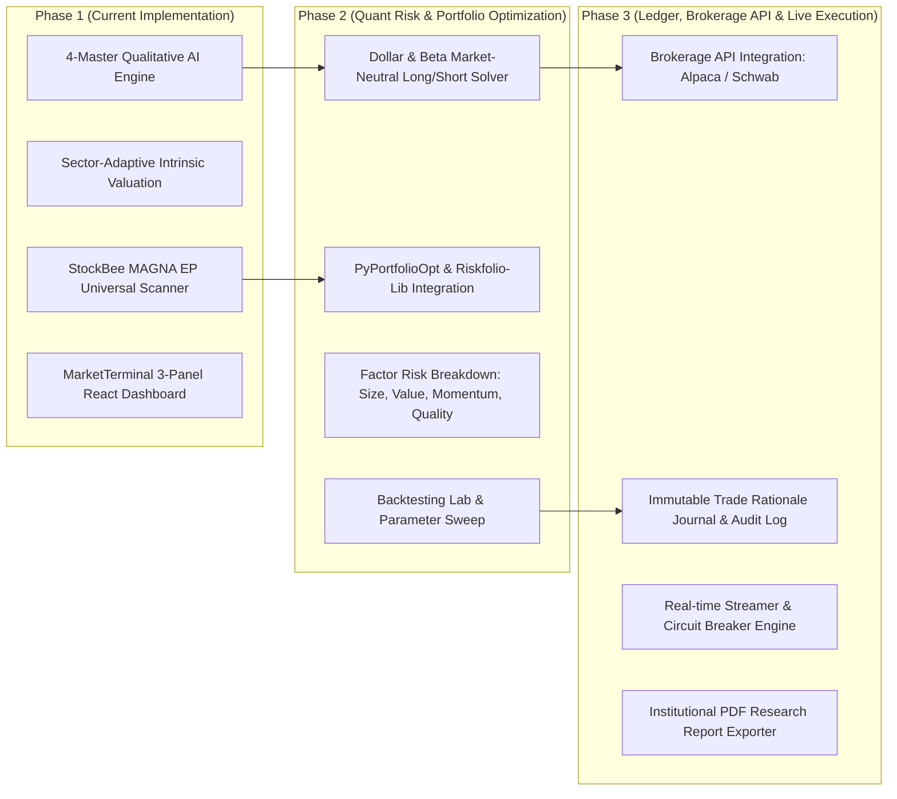

# Implementation Roadmap: Institutional Stocks & ETFs Long/Short PMS (`institutional-pms`)

This document presents the complete 3-phase development roadmap for `institutional-pms`, moving from Qualitative AI Fundamental Research to Quantitative Risk Market-Neutral Portfolio Optimization and Production Execution.

---

## 🗺️ Multi-Phase Strategic Architecture

---

## 🎯 Phase Specifications Breakdown

### Phase 1: Qualitative AI Research & Universal MAGNA Engine (ACTIVE PHASE)
* **Core Engine:** Gemini 3.6 Multi-Agent (Buffett, Munger, Duan Yongping, Li Lu).
* **Valuation Model:** Sector-Adaptive Intrinsic Valuation Engine (SBC-Adjusted FCF, Rule of 40, DDM, Mid-Cycle Earnings).
* **Scanner:** Unified StockBee MAGNA EP & Quality Screener (5-Point MAGNA Score 0–100).
* **Technical Charting:** Embedded TradingView Technical Analysis via `tradingview-mcp`.
* **Interface:** MarketTerminal 3-Panel React Interface (Scrollable Watchlist, Central Views, Multi-Feed News Portal).

### Phase 2: Quantitative Risk Engine & Market-Neutral Optimizer (FUTURE PHASE)
* **Long/Short Portfolio Optimizer:** `PyPortfolioOpt` / `Riskfolio-Lib` solving for maximum Sharpe Ratio under strict Dollar-Neutral ($|\sum w_i| \le 0.02$) and Beta-Neutral ($|\beta_{portfolio}| \le 0.05$) constraints.
* **Factor Exposure Controls:** Constrains factor bets across Fama-French 5 factors (Size, Value, Profitability, Investment, Momentum).
* **Backtesting Lab:** Historical simulation of combined 4-Master Moat + StockBee MAGNA EP long/short signals.

### Phase 3: Brokerage Execution, Trade Ledger & Audit Log (FUTURE PHASE)
* **Brokerage API:** Alpaca Markets / Charles Schwab REST & WebSocket streamers.
* **Trade Rationale Journal:** SQLite/PostgreSQL persistence enforcing 5-sentence Mirror Test verification prior to order execution.
* **Institutional PDF Exporter:** ReportLab PDF generator rendering institutional investment memos for IC (Investment Committee) review.

---

## 📅 Milestones & Delivery Schedule

| Phase | Milestone | Deliverables | Target Status |
| :--- | :--- | :--- | :--- |
| **Phase 1** | Qualitative AI Engine & Universal Scanner | Python FastAPI Backend (`backend/`) + React Frontend (`frontend/`) | 🛠️ **In Active Development** |
| **Phase 2** | Quant Risk & Long/Short Optimizer | Market-Neutral Optimizer (`backend/app/services/portfolio_optimizer.py`) | ⏳ Scheduled |
| **Phase 3** | Brokerage Execution & Trade Journal | Alpaca API streaming & PDF export engine | ⏳ Scheduled |
